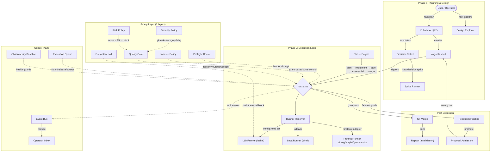

# hast Architecture: The Autonomous Software Factory

hast는 계층적 에이전트 스웜 아키텍처로 자율 기능 개발을 수행한다.
이 문서는 실제 코드 구현(`src/hast/`)에 기반하여 시스템의 구조와 동작을 설명한다.

## System Pipeline

## Core Subsystems

### 1. Planning & Design

#### Architect (`core/architect.py`)
- **역할**: 사용자 지시를 구조화된 Goal + BDD feature로 변환.
- **입력**: 사용자 instruction + 현재 `goals.yaml`.
- **출력**: 새 Goal entries + `features/*.feature` 파일.
- **실행 메타데이터 자동 부여**: goal 제목/노트에서 키워드("decision", "interface", "trade-off" 등)를 감지하여 `auto_eligible`, `decision_required`, `blocked_by` 어노테이션 자동 설정.
- **엔진**: `hast plan` (고지능 모델, e.g. Claude Opus).

#### Goals (`core/goals.py`)
- **구조**: 트리 형태. 각 Goal은 `id`, `title`, `status`, `phase`, `state` + 실행 메타데이터를 가짐.
- **Status lifecycle**: `pending` → `active` → `done` | `blocked` | `dropped` | `obsolete` | `superseded`.
- **Phase lifecycle**: `plan` → `implement` → `gate` → `adversarial` → `merge`.
- **핵심 필드**: `spec_file`, `decision_file`, `allowed_changes`, `depends_on`, `auto_eligible`, `uncertainty`.

#### Decision System (`core/decision.py`)
- **역할**: 설계 의사결정을 구조화된 검증 매트릭스로 관리.
- **구조**: 질문 + 대안들 + 5개 기본 평가 기준(contract_fit, regression_risk, operability, delivery_speed, security_posture) + 가중 점수.
- **플로우**: `hast decision new` → 티켓 생성 → `hast decision spike` → 병렬 검증 → `hast decision evaluate` → 승인/리뷰.

#### Spike Runner (`core/spike.py`)
- **역할**: Decision 대안들을 격리된 git worktree에서 병렬 실행하여 경험적 비교.
- **비교 기준** (spike_policy.yaml): pass 여부 → diff_lines → changed_files → duration.
- **출력**: 승자 ID + 이유 코드 + 비교 메트릭.

#### Design Explorer (`core/explore.py`)
- **역할**: 읽기 전용. 코드베이스 영향도 분석 + 후보 접근법 제시.
- **출력**: 매칭 심볼/파일 + caller 분석 + 관련 테스트 + 접근법 제안.
- **엔진**: `hast explore "<질문>"`.

### 2. Execution Engine

#### Auto Loop (`core/auto.py`)
3개의 실행 모드를 Goal 속성에 따라 라우팅:

| 모드 | 트리거 조건 | 동작 |
|------|------------|------|
| **BDD** | `goal.spec_file` 존재 | Spec → Test Gen (RED) → Implementation (GREEN) |
| **Legacy** | `phase`가 None | 단일 페이즈 실행, 페이즈 인식 없음 |
| **Phased** | `phase` 값 존재 | plan → implement → gate → adversarial → merge 상태머신 |

Gate 페이즈 진입 시 `evaluate_phase()`로 기계적 검증, 실패 시 `implement`로 회귀.

#### Runner Routing (`core/runner.py`, `core/runners/`)
GoalRunner 인터페이스의 3개 구현체:

| Runner | 파일 | 선택 조건 | 용도 |
|--------|------|----------|------|
| **ProtocolRunner** | `runners/protocol.py` | `tool_name ∈ SUPPORTED_PROTOCOL_ADAPTERS` | LangGraph/OpenHands 등 외부 오케스트레이터 |
| **LLMRunner** | `runners/llm.py` | `config.roles.worker` 또는 `config.roles.architect` 설정됨 | litellm 기반 LLM 호출 (prompt caching 지원) |
| **LocalRunner** | `runners/local.py` | fallback | 셸 명령 실행 (`{prompt_file}` 템플릿 치환) |

라우팅 우선순위: 명시적 runner > Protocol 어댑터 매칭 > LLM role 설정 > Local fallback.

#### Phase Engine (`core/phase.py`)
- **페이즈 순서**: `plan` → `implement` → `gate` → `adversarial` → `merge`.
- **회귀**: gate/adversarial 실패 시 항상 `implement`로 rollback.
- **에이전트 매핑**: plan → opus, implement → codex, adversarial → codex.
- **템플릿**: `.ai/templates/{phase}.md.j2` (Jinja2).

### 3. Safety Layer (6 layers)

| Layer | 모듈 | 역할 | 차단 조건 |
|-------|------|------|----------|
| **Preflight Doctor** | `core/doctor.py` | 실행 전 환경 검증 | git dirty, worktree 문제 |
| **Filesystem Jail** | `utils/file_parser.py` | LLM 출력에서 파일 추출 시 경로 탈출 방지 | 절대 경로, path traversal |
| **Immune Policy** | `core/immune_policy.py` | 자율 편집에 대한 불변 가드레일 | 보호 경로(`.ai/policies/**`) 수정, grant 없는 쓰기, grant 만료, 변경 120파일 초과 |
| **Quality Gate** | `core/gate.py` | 머지 전 기계적 검증 | pytest/mypy/ruff 실패, diff 초과, scope 위반, mutation score 미달 |
| **Security Policy** | `core/security_policy.py` | 보안 스캐닝 | gitleaks/semgrep/trivy/grype 탐지 (ignore rule + 만료 관리) |
| **Risk Policy** | `core/risk_policy.py` | 위험도 정량화 + 임계치 시행 | score ≥ 95 → block, score ≥ 80 → rollback |

**Risk Score 계산**: 실패 분류 base score + phase weight + sensitive path bonus + security issue bonus → [0, 100] clamp.

### 4. Control Plane

#### Execution Queue (`core/execution_queue.py`)
- **역할**: 리스 기반 Goal claiming. Worker가 goal을 claim/release하며 TTL로 만료 관리.
- **정책**: 기본 lease 30분, 최대 240분, worker당 최대 1 active claim.
- **멱등성**: idempotency_key로 중복 claim 재사용.
- **CLI**: `hast queue claim|renew|release|list|sweep`.

#### Event Bus (`core/event_bus.py`)
- **역할**: Append-only 이벤트 로그 (`.ai/events.jsonl`) + shadow reducer.
- **이벤트**: auto_attempt, goal_invalidation, decision_spike, claim_created 등.
- **Replay**: 중복 제거 후 goal_views + operator_inbox 스냅샷 생성.
- **CLI**: `hast events replay`.

#### Operator Inbox (`core/operator_inbox.py`)
- **역할**: 사람/봇 개입이 필요한 항목의 정책-액션 루프.
- **액션**: approve / reject / defer + 선택적 goal status 전이.
- **CLI**: `hast inbox list|summary|act`.

#### Observability Baseline (`core/observability.py`)
- **역할**: 시스템 건강 지표 수집 + 가드 판정.
- **지표**: success_rate, first_pass_success_rate, retry_rate, block_rate, security_incident_rate, MTTR, claim_collision_rate.
- **임계치**: first_pass ≥ 0.40, block_rate ≤ 0.35, security_incident ≤ 0.20, MTTR ≤ 180분, claim_collision ≤ 0.15.
- **CLI**: `hast observe baseline`.

### 5. Post-Execution & Feedback

#### Replan (`core/replan.py`)
- **역할**: Goal 완료 후 관련 goal 자동 무효화.
- **트리거**: 완료된 goal의 `obsoletes`, `supersedes`, `merges` 필드 + 동일 proposal fingerprint 휴리스틱.

#### Feedback Pipeline (`core/feedback.py`, `core/feedback_infer.py`, `core/feedback_publish.py`)
- **수집**: `hast feedback note` (명시적) + `hast feedback analyze` (evidence 기반 자동 추론).
- **집계**: `hast feedback backlog` → manager backlog 후보.
- **발행**: `hast feedback publish` → 외부 이슈 트래커 발행.

#### Proposal Admission (`core/proposals.py`, `core/admission.py`)
- **플로우**: proposal note 축적 → fingerprint 기반 중복 제거 → admission policy 평가 → goal 승격.
- **정책**: 빈도 ≥ 2회, 신뢰도 ≥ 0.6, TTL 30일, high-risk fast-track 지원.

### 6. Support Systems

#### Context Assembly (`core/context.py`)
3-tier 스코핑으로 LLM 세션 컨텍스트 구성:
- **Tier 1** (전문 읽기): context files, test files, allowed changes.
- **Tier 2** (참조만): Tier 1의 import 관계 파일 (최대 40개).
- **압축**: `max_context_bytes` 초과 시 file_contents → code_overview → rules 순으로 축소.

#### Configuration (`core/config.py`)
- `test_command`, `ai_tool`, `timeout_minutes`, `max_retries`, `max_context_bytes`.
- `gate`: pytest/mypy/ruff/mutation/security/diff 설정.
- `circuit_breakers`: 세션당 최대 사이클, no-progress 한도.
- `roles`: architect/worker/tester 모델 설정.
- `always_allow_changes`: 항상 허용되는 파일 패턴.

## CLI Command Map (42 commands)

| 영역 | 명령 | 수 |
|------|------|---|
| 초기화 | `init`, `doctor` | 2 |
| 분석/탐색 | `context`, `map`, `explore`, `sim` | 4 |
| Goal 실행 | `auto`, `retry`, `plan`, `focus` | 4 |
| Goal 관리 | `status`, `merge`, `handoff`, `triage`, `metrics` | 5 |
| 제어면 | `orchestrate`, `observe baseline` | 2 |
| 이벤트 | `events replay` | 1 |
| 실행 큐 | `queue claim|renew|release|list|sweep` | 5 |
| Operator Inbox | `inbox list|summary|act` | 3 |
| Immune | `immune grant` | 1 |
| 피드백 | `feedback note|analyze|backlog|publish` | 4 |
| 제안/입학 | `propose note|list|promote` | 3 |
| 의사결정 | `decision new|evaluate|spike` | 3 |
| 문서화 | `docs generate|mermaid|sync-vault` | 3 |
| 외부 프로토콜 | `protocol export|ingest` | 2 |

모든 명령은 `--json` 플래그로 기계 판독 가능 출력을 지원한다.
